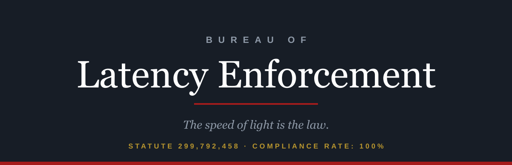

<p align="center">
  
</p>

<p align="center">
  <strong>The speed of light is the law.</strong><br>
  You cannot outrun it, and there is nowhere it does not reach.
</p>

---

This repository contains the public site for the Bureau of Latency
Enforcement (latencyenforcement.org, candidate domain, not yet purchased),
the regulator of record for the only rule in networking with a 100 percent
compliance rate, zero staff, and no budget. The Bureau exists to take
credit for this.

## The Bureau

Light in optical fiber travels at roughly 200,000 kilometers per second,
about two thirds of its vacuum speed, which sets a hard minimum on every
network round trip on Earth. Statute 299,792,458 &sect; 1.5 provides that
no packet shall arrive before it physically can. Penalties for violation:
not applicable, as violation is not applicable. Claims of violation are
prosecuted under &sect; 2 (Fraud, Benchmarketing).

## What the tools actually do

Both instruments on the site are real, client-side, and factual:

* **The minimum lawful latency calculator** takes two of 32 endpoints,
  computes the great-circle distance with the haversine formula, and
  issues the physical floor for a fiber round trip at 200 km/ms, plus a
  typical-observed figure (floor times 2.1, plus 5 ms) that accounts for
  geography, routing, and equipment, in that order of blame.
* **The violation audit** takes a claimed RTT between the selected
  endpoints. Below the physical minimum earns a citation for
  benchmarketing in the first degree. Within 40 percent of the floor is
  lawful but suspiciously excellent. Anything else is thanked for its
  honesty, or its adequate infrastructure, whichever applies.
* **Case BLE-1996-500MI** is genuine: the 1996 "500-mile email" incident,
  in which a mail server timing out at about 3 milliseconds could not
  reach hosts farther than 3 light-milliseconds away. The finest latency
  enforcement action ever taken, by no one.

---

## Development notes

The parody ends here. The rest of this file is accurate.

### Layout

A static, zero-build, zero-dependency site. Two HTML files and a handful
of generated images. There is no framework, no bundler and no
`package.json`. Cloudflare Pages serves the repository root exactly as it
appears here.

```
index.html            the site, calculator and audit included
404.html              catch-all, served automatically by Cloudflare Pages
favicon.svg           icon source of truth (64px grid)
favicon.ico           16/32/48, generated
apple-touch-icon.png  180x180, generated
og.png                1200x630 share image, generated
assets/logo.svg       wordmark, text outlined, used at the top of this README
tools/og.html         source for og.png
tools/logo-src.svg    source for assets/logo.svg, text still live
tools/favicon-16.svg  pixel-grid 16px icon, used for the smallest .ico entry
Makefile              asset regeneration only, never runs at deploy time
_headers              Cloudflare Pages header rules
robots.txt            permissive
wrangler.toml         Cloudflare Pages configuration
mise.toml             pins the Wrangler version used to deploy
```

The page makes zero requests to any external domain. Headings are Georgia
with serif fallbacks and body type is Helvetica Neue with Arial fallbacks,
so there are no webfonts to host or wait for. The badge in the page header
is an inline image embedded in `index.html`, not a separate asset.

### The production domain

`latencyenforcement.org` is a candidate; the domain has not been
purchased. It is hardcoded, deliberately, and nothing derives it from
anything else:

| File | What to change |
| --- | --- |
| `index.html` | `rel=canonical`, `og:url`, `og:image`, `twitter:image` |
| `404.html` | nothing, the 404 uses only root-relative paths |
| `tools/og.html` | the domain printed in the footer of the share image |
| `README.md` | this table, and the mentions above it |

After changing `tools/og.html`, re-run `make og`.

### Local preview

```sh
make serve          # python3 -m http.server 8000
```

Then open `http://localhost:8000`. A local server is preferable to opening
the file directly because the icon paths are root-absolute.

### Regenerating images

Only needed when the wordmark, the icon or the share image changes.
Requires `google-chrome`, ImageMagick 7 (`magick`) and Inkscape on the
machine doing the regenerating; none of them is needed to deploy, because
the outputs are committed. The serif renders want a real Georgia on the
fontconfig path; this machine has one in `~/.local/share/fonts`.

```sh
make assets         # everything below
make og             # og.png     <- tools/og.html, via headless Chrome
make favicon        # favicon.ico + apple-touch-icon.png <- the SVG sources
make logo           # assets/logo.svg <- tools/logo-src.svg, text outlined
```

`make logo` outlines the wordmark's text so the README renders the same
whether or not the viewer has Georgia. Inkscape rewrites the whole file,
so the `GENERATED` comment at the top has to be pasted back afterwards.

### Deploying

Wrangler is configured via `wrangler.toml`, so a deploy is one command
from an authenticated shell:

```sh
make deploy         # wrangler pages deploy .
```

The Wrangler version is pinned by `mise.toml` (this machine manages its
Wrangler through [mise](https://mise.jdx.dev/); the global config tracks
`latest`, the repo pins an exact version). To move the pin, edit
`mise.toml`, run `mise install`, and deploy once to confirm nothing moved
underneath.

### Which Cloudflare account this deploys to

This machine has two Cloudflare identities, and picking the wrong one
deploys this site into an unrelated organisation.

**Pages configuration cannot pin the account.** `account_id` is a
Workers-only key; putting it in a Pages `wrangler.toml` makes Wrangler
refuse to run. So the account is selected by **an auth profile bound to
this directory**, recorded in
`~/.config/.wrangler/profiles/directory-bindings.json`:

```sh
wrangler auth activate personal    # already done; re-run after moving the repo
wrangler whoami                    # must print: Active profile: personal
```

Without a binding, Wrangler falls back to the `default` profile, which
here is the other organisation, and it will deploy there without asking.
**Check `whoami` before deploying.** The binding lives outside the repo,
so a fresh clone, a moved directory, or another machine all need
`wrangler auth activate` again.

One extra trap: Wrangler caches the resolved account in the untracked
`.wrangler/cache/wrangler-account.json` inside this directory. If a deploy
ever went to the wrong account from here, activating the right profile is
**not** enough; delete `.wrangler/` as well, or the cached account ID wins
and the API call fails with `Authentication error [code: 10000]`.

For CI, where profiles do not exist, set `CLOUDFLARE_ACCOUNT_ID` (the
account to deploy into) and `CLOUDFLARE_API_TOKEN` (credentials scoped to
it) as environment variables.

The Pages project is `latencyenforcement`, production branch `main`, with
no build command and the build output directory set to `/`. If you ever
recreate it from the dashboard, use exactly those values; there is nothing
to build, and any build command entered there will only make the
deployment worse.

To wire the Git integration instead, connect the
`holthe/bureau-of-latency-enforcement` repository under **Workers & Pages
-> Create -> Pages -> Connect to Git** with the same settings. Note that
the repository name is hyphenated and the Pages project name is not; the
project name matches the domain.

### Custom domain

Deploy at least once first, so the project exists. Then, once
`latencyenforcement.org` (or whatever the site ends up on) is actually
registered:

1. **Add the zone to Cloudflare**, unless the domain was bought through
   Cloudflare, in which case it is already there. Dashboard -> **Add a
   site** -> the domain -> Free plan. Repoint the registrar's nameservers
   at the two Cloudflare ones and wait for the zone to go active.
2. **Attach the domain to the Pages project.** Dashboard -> **Workers &
   Pages** -> `latencyenforcement` -> **Custom domains** -> **Set up a
   custom domain**. Because the zone is on Cloudflare, the required CNAME
   record (apex, flattened, proxied, pointing at
   `latencyenforcement.pages.dev`) is created for you. **Do not create
   the record by hand first**; a pre-existing CNAME blocks the flow
   outright.
3. **Repeat for `www`** if both should resolve.
4. **Wait for the certificate.** Issuance normally completes within a few
   minutes of the record appearing.

Until then the site is reachable at `latencyenforcement.pages.dev`.

### Related

The Bureau is a division of
[Best Effort Industries](https://besteffortindustries.com) and is
registered as division 014 in the operating divisions table in that
repository's `index.html`. The site footer's document number, BEI-010,
predates the registration and does not match; the discrepancy has been
audited and found to respect the speed of light, which exhausts the
Bureau's remit.

## License

Parody. The physics is real, the 500-mile email is real, and the Bureau
is the only thing on the premises with no measurable latency, having
never responded to anything.
